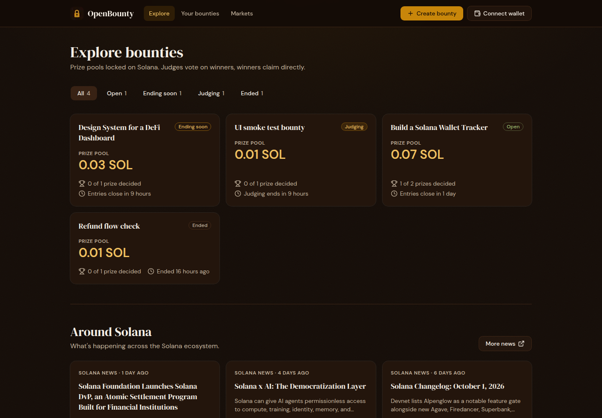
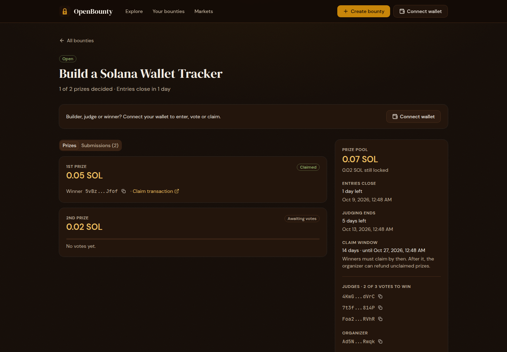
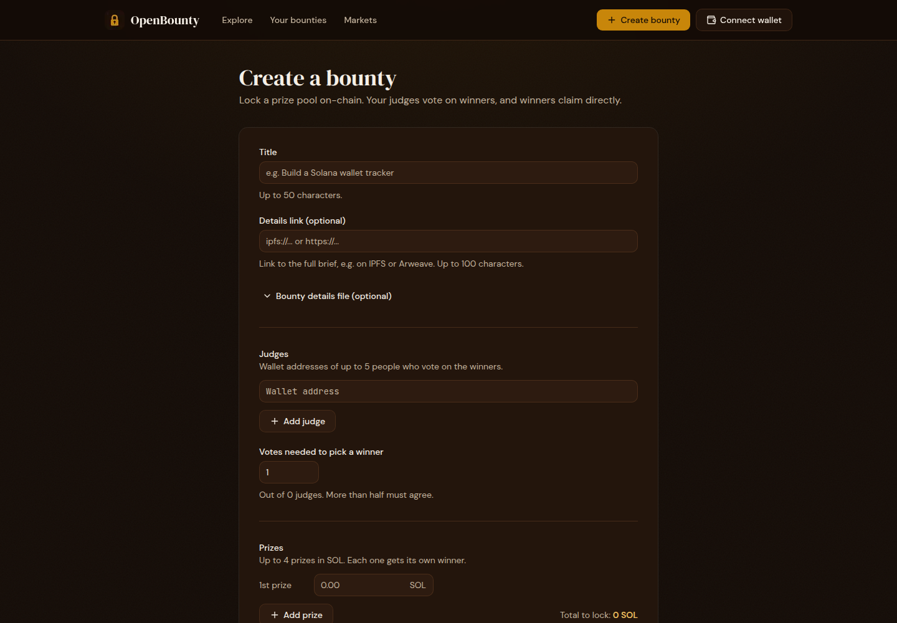
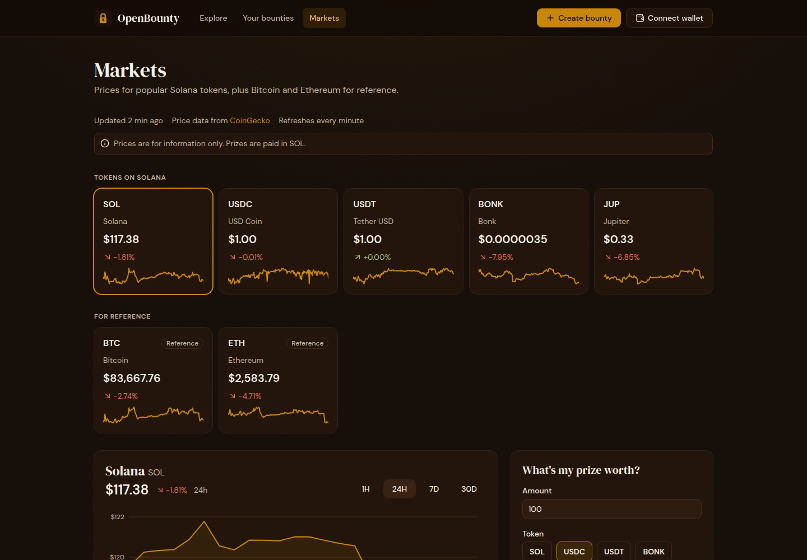

# OpenBounty

[](https://github.com/secur3shell-ship-it/OpenBounty/actions/workflows/ci.yml)
[](LICENSE)

**Trustless prize bounties on Solana.** An organizer locks the whole prize pool on-chain when the bounty is created. Builders submit their entries on-chain, judges vote on-chain, and winners claim their prize directly. Nobody (not even the organizer) can change the result or take the money once it's locked.

**Try it:** [open-bounty-ten.vercel.app](https://open-bounty-ten.vercel.app) (Solana **devnet**, no real money)

Built for [Colosseum's Crypto World's Fair](https://colosseum.com/worldsfair) hackathon (Solana track).

---

## Contents

- [Why OpenBounty](#why-openbounty)
- [How it works](#how-it-works)
- [Features](#features)
- [Screenshots](#screenshots)
- [How to use it](#how-to-use-it)
- [Rules the program enforces](#rules-the-program-enforces)
- [Try it in five minutes (for judges)](#try-it-in-five-minutes-for-judges)
- [Deployment](#deployment)
- [How it's built](#how-its-built)
- [Testing and checks](#testing-and-checks)
- [Run it yourself](#run-it-yourself)
- [Security](#security)
- [Roadmap](#roadmap)
- [FAQ](#faq)
- [License](#license)

---

## Why OpenBounty

Hackathon and community bounties usually run on trust:
- the organizer promises a prize, then picks winners in a private chat;
- winners wait for someone to send the money, sometimes for weeks;
- nobody can check that the prize was ever there.

OpenBounty puts every step on-chain:
- **The money is locked up front.** A bounty can't exist without its full prize pool in a vault the program controls.
- **Judging is public.** Every vote is a signed transaction anyone can see.
- **Payouts are automatic and self-service.** A winner is decided the moment enough judges agree, and the winner claims the prize themselves. No one has to approve it.
- **Refunds are limited by rules.** The organizer gets back only what the rules allow, only after the deadlines.

## How it works

Every bounty has three dates, set by the organizer:

```text
  created          entries close        judging ends            claim window ends
     │  builders enter  │  judges keep voting  │  winners claim their prize  │
     ●──────────────────●─────────────────────●─────────────────────────────●──────▶
     │                  │                      │                             │
  prize pool         no new entries        no more votes;          unclaimed winners' prizes
  locked in vault                          prizes with no winner   can be refunded too
                                           can be refunded
```

1. **Create.** The organizer sets a title, up to 5 judges, how many votes pick a winner (always more than half of the judges), up to 4 prizes in SOL, and the three dates. The whole prize pool moves into a program-controlled vault in the same transaction.
2. **Enter.** Builders submit an entry (project name, link, short description) before entries close.
3. **Judge.** Each judge votes for a candidate on each prize. A vote can't be changed. As soon as one candidate reaches the required votes, the program records them as that prize's winner.
4. **Claim.** The winner claims the prize straight from the vault, any time until the claim window ends (the organizer picks 1–90 days, 14 by default).
5. **Refund.** After judging ends, the organizer can take back prizes that never got a winner. After the claim window ends, also prizes whose winner never claimed.
6. **Close.** When every prize is claimed or refunded, the bounty closes and its storage deposit goes back to the organizer.

## Features

| Area | What you can do |
|---|---|
| **Explore** | Browse every bounty, filter by status (Open, Ending soon, Judging, Ended), and see each prize pool, your role and the next deadline. Below it, the latest news from around Solana. |
| **Create a bounty** | A guided form with live checks: title, optional details link, judges, votes needed, prizes, timeline (entries close, judging ends, claim window) and a summary of when winners can claim. An optional builder makes a details file (longer description, hackathon info, judge names, prize labels, links) to download and host. |
| **Bounty page** | Three tabs: **Prizes** (each prize's votes, winner, claim deadline and claim transaction), **Submissions** (every entry with its link and vote count), and **Judging** (for judges only). A side panel shows the prize pool, the three dates, the judges, the organizer and the escrow account. |
| **Submit an entry** | Builders enter with a project name, link and short description. After judging ends they can close their entry to get its small storage deposit back. |
| **Judging board** | Judges score each entry privately (Innovation, Execution, Impact, 1–5 each, saved only in their browser), compare scores side by side, then vote by dragging an entry onto a prize or picking it from a menu. A confirmation says exactly what the vote will do. |
| **Claim** | Winners claim with one click while the claim window is open. |
| **Refund** | One click refunds every prize that can be refunded right now, in one transaction. The page says which prizes still belong to their winners and until when. |
| **Your bounties** | A to-do list across all bounties: prizes to vote on, prizes ready to claim (with the claim-by date), refunds available, plus the bounties you organize or judge and all your entries, including ones on bounties that have closed. |
| **Markets** | Prices, 24-hour change and 7-day trends for SOL, USDC, USDT, BONK, JUP, BTC and ETH, a chart with 1H / 24H / 7D / 30D ranges, and a "What's my prize worth?" converter filled in with your prize. Prices from CoinGecko, refreshed every minute. |
| **Wallets** | Any Solana wallet that supports Wallet Standard (Phantom, Solflare, Backpack, ...). |

## Screenshots

| Explore | A bounty |
|---|---|
|  |  |
| **Create a bounty** | **Markets** |
|  |  |

## How to use it

Switch your wallet to **devnet** first, and get free devnet SOL from [faucet.solana.com](https://faucet.solana.com).

### Organizers

1. Click **Create bounty** and connect your wallet.
2. Fill in the title, your judges' wallet addresses and the votes needed. The form suggests the smallest majority.
3. Add up to 4 prizes in SOL. The form shows the total you'll lock.
4. Set the timeline. Entries must close at least 10 minutes from now, judging can end at most a year away, and the claim window is 1–90 days (14 by default).
5. Optional: open **Bounty details file**, fill it in, download the JSON, host it (IPFS, Arweave or any https host) and paste its link into **Details link**.
6. Click **Lock prizes and create** and approve in your wallet. Share the bounty link with builders and judges.
7. After judging ends, open the bounty (or **Your bounties → Refund available**) and click **Refund** for anything that can be refunded.

### Builders

1. Open the bounty and go to the **Submissions** tab.
2. Click **Submit entry**, add your project name, a link (https:// or ipfs://) and a short description, and approve in your wallet. Use the wallet that should receive the prize.
3. Follow your entry's votes on the same tab. If you win, the prize appears in **Your bounties → Ready to claim**.
4. Click **Claim** before the claim window ends.
5. After judging ends, close your entry from **Your bounties → Your entries** to get its deposit back.

### Judges

1. Connect the wallet the organizer added as a judge. **Your bounties → Needs your vote** lists every prize waiting for you.
2. On the bounty page, open the **Judging** tab. Score the entries if you like (only you can see your scores), and use **Compare scores** to rank them.
3. Drag an entry onto a prize, or use **Vote as...**. Read the confirmation and approve in your wallet. Votes are final.

### Everyone

- **Explore** and every bounty page work without a wallet.
- **Markets** works without a wallet; the prize converter fills itself in when your wallet has a prize to claim.

## Rules the program enforces

These are checked by the on-chain program itself, so neither the website nor the organizer can get around them.

| Rule | Detail |
|---|---|
| Fully funded | Creating a bounty and locking its whole prize pool happen in one transaction. There's no "add money later". |
| Organizer can't steer the result | The organizer can't be a judge, can't vote, can't pick or change a winner, and can't take money out before the deadline. |
| Judges | 1–5 judges, no duplicates. The votes needed must be more than half of the judges, so two groups can never both pick a winner. |
| Votes | Only judges, only until judging ends, one vote per judge per prize, and votes can't be changed. |
| Valid winners | A winner can't be the organizer, a judge, the zero address or the bounty's own accounts. The same person may win several prizes. |
| Automatic winners | A prize's winner is set the moment a candidate reaches the votes needed. |
| Claims | Only the winner, only once, until the claim window ends. |
| Refunds | Only the organizer. Prizes with no winner: after judging ends. Prizes whose winner didn't claim: after the claim window ends. A claimed prize is never refundable. |
| Entries | Before entries close, one per wallet per bounty, never from the organizer or a judge. Name ≤ 50 bytes, link ≤ 100 bytes, description ≤ 280 bytes. |
| Limits | Title ≤ 50 bytes, details link ≤ 100 bytes, up to 4 prizes of at least 0.001 SOL each, deadline at most 365 days away. |
| No admin | There is no admin key, no override and no emergency withdrawal in the program. |

## Try it in five minutes (for judges)

1. Install Phantom or Solflare, switch it to **devnet**, and get devnet SOL from [faucet.solana.com](https://faucet.solana.com).
2. Open [open-bounty-ten.vercel.app](https://open-bounty-ten.vercel.app) and connect the wallet.
3. **As a builder:** open any bounty that's still open, go to **Submissions** and submit an entry.
4. **As an organizer:** create a bounty with a 0.01 SOL prize, and use a second wallet of yours as the only judge (1 of 1 vote needed). Set entries to close in about 11 minutes and judging to end soon after.
5. **As a judge:** switch to that second wallet, open the **Judging** tab and vote for an entry. It wins immediately.
6. **As the winner:** switch to the winning wallet and click **Claim**. The prize shows "Claimed" with a link to the transaction.
7. **Refunds:** create another bounty, let judging end without votes, then click **Refund** as the organizer. The bounty closes and the SOL comes back.

Every step can be checked on [Solana Explorer](https://explorer.solana.com/address/HTvHgRG4uHnj1KQeynNXsKEvBE3oqsc9TxRaGTgqgEk4?cluster=devnet).

## Deployment

| What | Value |
|---|---|
| Network | Solana devnet |
| Website | [open-bounty-ten.vercel.app](https://open-bounty-ten.vercel.app) |
| Program ID | [`HTvHgRG4uHnj1KQeynNXsKEvBE3oqsc9TxRaGTgqgEk4`](https://explorer.solana.com/address/HTvHgRG4uHnj1KQeynNXsKEvBE3oqsc9TxRaGTgqgEk4?cluster=devnet) |
| Program name | `openbounty_v2` |
| ProgramData account | [`FheYHSZ3qgeCyTVy2GkhYty3BqEKG4NG1Y8jusnCKaBH`](https://explorer.solana.com/address/FheYHSZ3qgeCyTVy2GkhYty3BqEKG4NG1Y8jusnCKaBH?cluster=devnet) (holds the program's code) |
| Upgrade authority | [`Ad5NzuNtFGG5GfWkSA4fkF3yViQiefv96BeESSMURwqk`](https://explorer.solana.com/address/Ad5NzuNtFGG5GfWkSA4fkF3yViQiefv96BeESSMURwqk?cluster=devnet), the project's deployer key for now; moving to a multisig (see [Roadmap](#roadmap)) |
| Program interface (IDL) | published on-chain at [`C3R2fiQ3EHwZHUSCPwWcAXrsVDGF67WSjmDQVwJqerFq`](https://explorer.solana.com/address/C3R2fiQ3EHwZHUSCPwWcAXrsVDGF67WSjmDQVwJqerFq?cluster=devnet) (Program Metadata), identical to `idl/openbounty_v2.json` in this repo |
| Mainnet | not deployed |

## How it's built

```text
Browser (Next.js website) ──► Solana devnet RPC ──► openbounty_v2 program
        │                                              ├── Escrow account (one per bounty: rules, prizes, votes)
        │                                              ├── Vault (holds the prize SOL; only the program can move it)
        │                                              └── Submission account (one per entry)
        └──► CoinGecko + Solana news feed (Markets page and news only)
```

- **On-chain program:** Rust with the Anchor framework (Anchor 1.2, Solana 4.1). Six instructions: `initialize_escrow`, `vote_winner`, `claim_prize`, `refund_unclaimed`, `submit_entry` and `close_entry`. Every state change emits an event.
- **Accounts:** an escrow and a vault per bounty, derived from the organizer and a counter, so one organizer can run up to 256 bounties at a time. The vault holds only the prize money.
- **Website:** Next.js 16 and React 19 with Tailwind CSS. It talks to the program through `@solana/kit` and a client generated from the program's interface. Wallets connect through Wallet Standard.
- **No backend.** The website reads accounts straight from Solana and asks your wallet to sign. There is no server or database holding bounty data, so the website can't change any result. Market prices and news are read by your browser from CoinGecko and Solana's public news feed.
- **Repository layout:**

  ```text
  programs/openbounty_v2/   the on-chain program (Rust)
  tests/                    integration tests (TypeScript)
  idl/                      the program's interface, shared with the website
  scripts/                  test runner, devnet deploy, devnet sample data
  offchain/                 the website (Next.js)
  ```

## Testing and checks

- **Program:** 52 integration tests on a local Solana network (Surfpool). They cover every rule above, every error and the attacks found in the security review, and use time travel to check the entry deadline, the judging deadline and the claim window. They also run on Solana's standard test validator, where the 14 time-travel tests are skipped. Rust unit tests check the account sizes; `rustfmt` and `clippy` keep the code clean.
- **Website:** 46 unit tests for the rules it checks before asking you to sign and for reading program events safely, plus type checking, linting and a production build.
- **On every push:** GitHub Actions runs all of the above ([CI](https://github.com/secur3shell-ship-it/OpenBounty/actions/workflows/ci.yml)), and checks that the committed program interface and the website's generated client match the code.
- **On devnet, through the website:** create, enter, vote (winner picked automatically), claim (bounty closes), refund after the deadline (bounty closes), and closing an entry after its bounty closed, all done with real devnet transactions, at desktop and phone widths.

## Run it yourself

**The website** (needs Node.js 20.18 or newer):

```bash
git clone https://github.com/secur3shell-ship-it/OpenBounty.git
cd OpenBounty/offchain
npm install
npm run dev            # http://localhost:3000, uses the public devnet RPC
```

Optional: create `offchain/.env.local` with `NEXT_PUBLIC_SOLANA_RPC_URL=<your devnet RPC URL>` for a faster RPC. Website checks: `npm run typecheck`, `npm run lint`, `npm test`, `npm run build`.

**The program tests** (need Rust 1.89, Anchor CLI 1.2.0, Solana CLI 4.1.2, Surfpool 1.5 and Yarn):

```bash
cd OpenBounty
yarn install
solana-keygen new --no-bip39-passphrase -o /tmp/openbounty-test.json   # a throwaway wallet for the local network
anchor keys sync                                                        # gives your local build its own program ID
OPENBOUNTY_WALLET=/tmp/openbounty-test.json yarn test                   # builds, starts a local network, runs the tests
cargo test -p openbounty_v2                                             # Rust unit tests
```

`anchor keys sync` changes the program ID in your local copy only; don't commit that change.

## Security

- **Devnet only, not audited.** Don't use it with real money yet.
- **Internal review (October 2026).** All six instructions were reviewed: signers, account substitution, arithmetic, time windows, closing and rent, and address reuse. One issue was found and fixed: an organizer could have blocked every claim by handing their own wallet to another program, then refunded the prizes. A test now covers that attack.
- **Report a problem** privately through the repository's Security tab. See [SECURITY.md](SECURITY.md).

## Roadmap

| Status | Item |
|---|---|
| ✅ Done | Fully funded bounties, on-chain entries, judge voting with automatic winners, claims with a claim window, rule-based refunds, closing and deposit returns |
| ✅ Done | Website: Explore, Create (with the details-file builder), bounty page with Prizes / Submissions / Judging, Your bounties, Markets, news |
| ✅ Done | Live on devnet with sample bounties |
| ✅ Done | Internal security review of the program, with fixes and tests; checks on every push (GitHub Actions) |

### Next goals

Each goal is removed from this list once it ships.

1. **Verifiable build.** Build the program in a standard, reproducible environment, so anyone can check that the code deployed on devnet matches this repository.
2. **Past bounties on Explore.** Closed bounties disappear from the website today. A "Past" list will show finished bounties, their winners and their payouts.
3. **Prizes in other tokens and on other chains (phase 2):**
   - prizes in USDC, USDT, BONK and JUP as well as SOL;
   - winners claim in the token of their choice;
   - USDC winners can receive their prize on another chain.
4. **Real-time markets.** Today the browser fetches prices every minute. A small read-only service will push live prices and news instead.
5. **Multisig upgrade authority.** Move the power to upgrade the program from one key to a multisig (Squads).
6. **Mainnet.** After an external audit: deploy under a multisig with a time lock, then make the program unchangeable after a quiet period.

## FAQ

**Is this real money?**
Not yet. Everything runs on Solana devnet, where SOL is free from the faucet.

**Can the organizer run off with the prize?**
No. The prize pool is in a vault only the program controls. The organizer can take back only prizes the rules allow, and only after the deadlines.

**Can the organizer pick the winner?**
No. Only the judges vote, and the program picks the winner when enough of them agree. The organizer can't be a judge.

**What if a judge disappears?**
Votes needed are more than half of the judges, not all of them. If a prize never reaches the votes needed by the end of judging, it has no winner and the organizer can refund it.

**What if I win but miss the claim window?**
The prize is yours until the claim window ends (14 days by default, shown on the bounty page and in Your bounties). After that, the organizer may refund it.

**Who can see my scores as a judge?**
Only you. Scores are saved in your browser and never sent anywhere. Only your votes are public.

**Why did a bounty disappear?**
When every prize is claimed or refunded, the program closes the bounty and returns its storage deposit. A history of finished bounties is on the roadmap.

**What does it cost to use?**
Normal Solana transaction fees, plus small refundable storage deposits: about 0.010 SOL for a bounty (returned to the organizer when it closes) and about 0.0034 SOL for an entry (returned when the builder closes it).

**Can the program be changed?**
On devnet it can still be upgraded, by the project's deployer key. Moving that power to a multisig is next on the roadmap, and on mainnet the program will be made unchangeable after an audit.

## License

[MIT](LICENSE)
